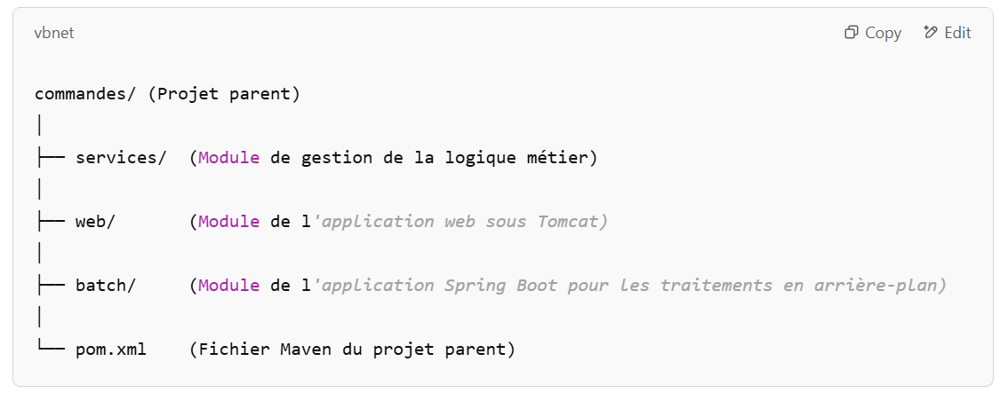
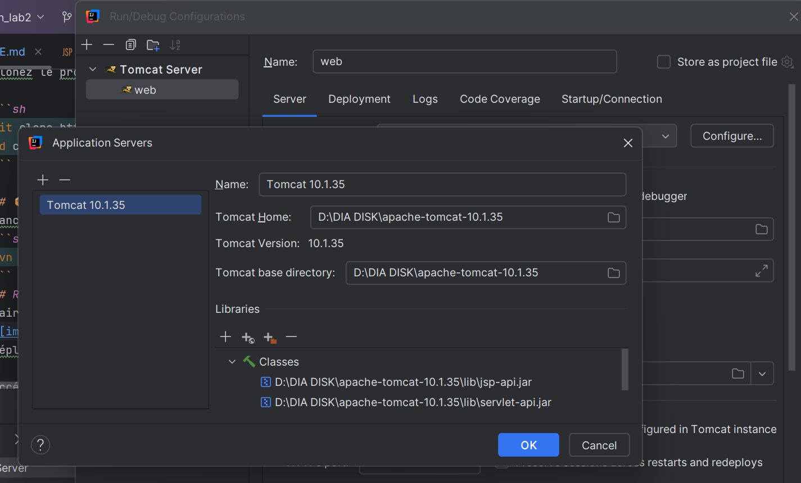
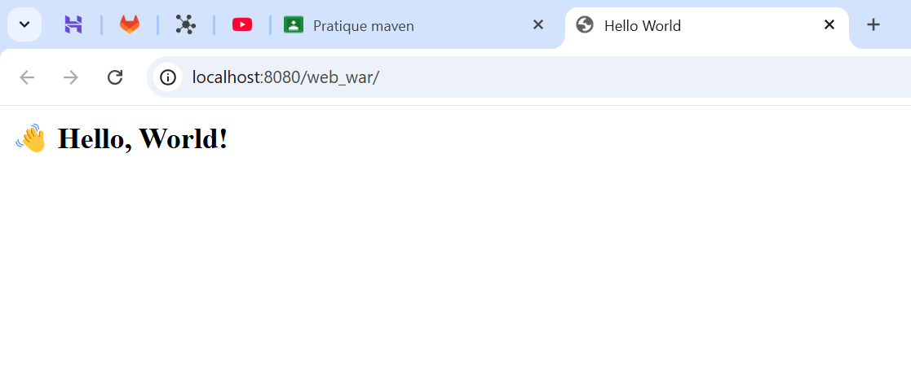

# 🛒 Commandes

Une application modulaire basée sur Maven pour la gestion des commandes.


## 📖 Description

Le projet **Commandes** est une application Java basée sur **Maven** et construite en **architecture modulaire**. Il sépare les différentes responsabilités à travers plusieurs modules :

- **Commandes (Parent)** : Gère les dépendances et la configuration globale du projet.
- **Services** : Contient la logique métier de l'application.
- **Web** : Application **Tomcat** qui utilisant JSP l'interface utilisateur..
- **Batch**: Application Spring Boot pour les traitements en arrière-plan. 

Cette architecture facilite la maintenance, l'évolutivité et la compréhension du code.

## 📁 Structure du projet




## 🔧 Prérequis

Avant de commencer, assurez-vous d'avoir installé :
```plaintext
- Java 17
- Maven 3.9
- Tomcat 10.1.35
```
## 🚀 Installation & Exécution

Clonez le projet et accédez au répertoire :

```sh
git clone https://github.com/KhadidjatouDIA/maven_lab2.git
cd commandes
```

## 📦 Testez le projet
Lancez la compilation et la génération des modules avec Maven :
```sh
mvn clean install
```
## Run Web (Tomcat)
Faire la configuration de son environnement de travail


Run le module Web sur Tomcat.


Accédez à l'interface via : **http://localhost:8080/web_war/**.


📧 Contact :
Si vous avez des questions, n'hésitez pas à me contacter: **sokhnakhadidjah@gmail.com.**